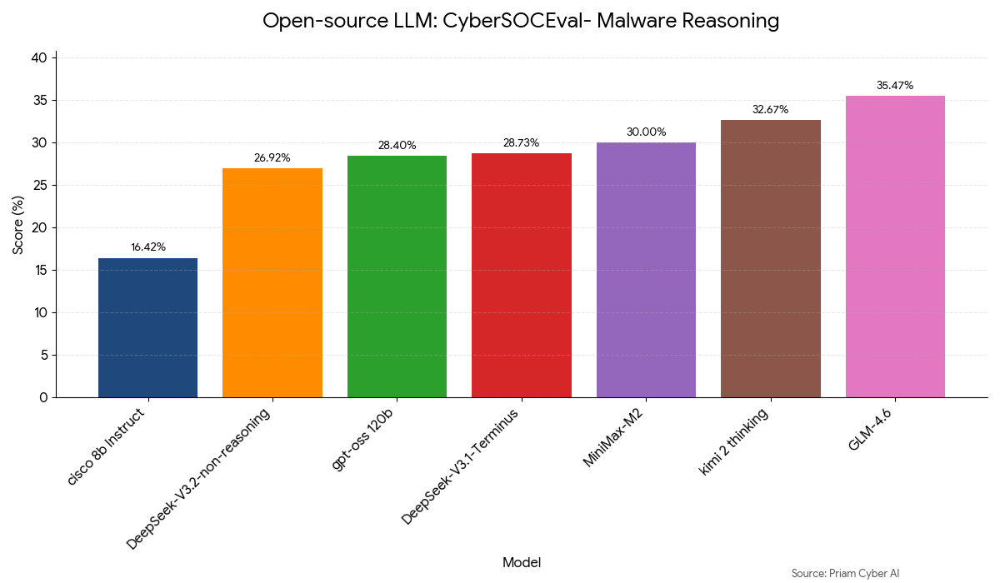

# 🛡️ CyberSOCEval: A Surprising Lesson from the Malware Reasoning Benchmark

## 🚀 1. Executive Summary

**Priam is attacking one of the most formidable challenges in automated security: CyberSOCEval.**

🏗️ **Building on the Foundation**
Leveraging the groundwork laid by **Meta and CrowdStrike** in their recent [landmark paper](https://arxiv.org/pdf/2509.20166), we are pushing the boundaries of what Large Language Models can achieve in the Security Operations Center. We specifically targeted **Task 1: Malware Investigation**, a domain that demands far more than simple pattern matching.

🏆 **Current Performance Ceiling**
Through rigorous experimentation with a variety of advanced techniques, **we have identified the current performance ceiling of open-source models to be 35.47%**, achieved by the **GLM-4.6** model.

💡 **Key Insight: "No Free Lunch"**
Our research reveals a critical reality: there is **"No Free Lunch"** when it comes to data formatting.
* We experimented with sophisticated encodings like **TOON** 📦 and **Knowledge Graphs** 🕸️ to beat the benchmark.
* **The Verdict:** Raw reasoning power currently outweighs clever prompt engineering.

🔥 **What's Next?**
We are not stopping here. We are now actively experimenting with even more advanced techniques to **shatter this ceiling**.

Figure 1: Infograph- Malware Reasoning Benchmark

---

## 🛠️ 2. Methodology

The **Malware Reasoning** task tests a model's precision and recall in identifying malicious activities. The test cases are derived from **Hybrid Analysis** reports generated by detonating samples in the CrowdStrike Falcon® Sandbox.

To determine if input structure affects reasoning, we benchmarked model performance using four distinct input representations of the same underlying data:

| Format | Description | Intended Benefit |
| :--- | :--- | :--- |
| **JSON** | The default system log format. | Leverages the inherent structure of the data as originally recorded. |
| **TOON** | **Token-Oriented Object Notation.** | A compact, schema-aware format designed to minimize tokens and improve parsing. |
| **Graph** | **Knowledge Graph (KG) Encoding.** | Represents data as a network of entities/relationships to facilitate multi-hop reasoning. |
| **Markdown** | Standard document formatting. | Provides a human-readable, visually organized structure (headings, lists). |

---

## 💡 3. Novel Representations

We integrated specific structured data formats intended to enhance LLM comprehension:

* **TOON (Token-Oriented Object Notation):** 📦 A proprietary format designed to be compact and human-readable while maintaining strict schema guardrails. [Learn more about TOON](https://github.com/toon-format/toon?tab=readme-ov-file).
* **Knowledge Graph (Graph):** 🕸️ This representation leverages the "Thinking in Graphs" methodology, encoding real-world entities and their relationships to theoretically guide the model through complex reasoning steps. [Reference Paper](https://arxiv.org/pdf/2412.10654).

---

## 📊 4. Detailed Results

The following table presents the accuracy benchmarks across different model families and representation formats.

| Model | Format | Accuracy |
| :--- | :--- | :--- |
| **GLM-4.6** | **JSON** | **35.47%** |
| GLM-4.6 | TOON | 34.86% |
| GLM-4.6 | Markdown | 33.16% |
| GLM-4.6 | Graph | 32.34% |
| Claude 3.5 Sonnet | Graph | 31.36% |
| Claude 3.5 Sonnet | TOON | 29.72% |
| Claude 3.5 Sonnet | JSON | 29.39% |
| Claude 3.5 Sonnet | Markdown | 27.91% |
| MiniMax-M2 | JSON | 30.00% |
| DeepSeek-V3.1-Terminus | JSON | 28.73% |
| GPT-OSS 120b | JSON | 28.40% |
| DeepSeek-V3.2-Non-reasoning | JSON | 26.92% |
| Cisco 8b Instruct | JSON | 16.42% |
| Cisco 8b Instruct | Graph | 16.42% |
| Cisco 8b Instruct | Markdown | 13.79% |
| Kimi 2 Thinking | JSON | 16.09% |

---

## 🔑 5. Key Findings & Discussion

The Malware Reasoning task presents a significant challenge to current models, with overall accuracy scores remaining low (peaking at ~35%).

### 🍱 The No Free Lunch Principle with Formats

The most significant finding is that **structured encoding provided no consistent lift**. 
* **GLM Family:** The standard **JSON** format (35.47%) slightly outperformed the highly structured TOON (34.86%) and Graph (32.34%) formats.

* **Claude Family:** The variance between formats was minimal, with Graph encoding (31.36%) only marginally outperforming standard JSON (29.39%).

This suggests that for specialized security tasks, the bottleneck is the model's fundamental domain reasoning capability, not the presentation or "syntax" of the data.

### 🏆 Open Source Parity with Proprietary Models

A notable finding is the impressive performance of open-source models. The **GLM-4.6** model achieved the highest overall score, outperforming established proprietary solutions like the Claude 3.5 family on this specific task. Furthermore, models like **GPT-OSS 120b** showed competitive performance (28.40%), indicating that high-quality open-source community models are performing on par with state-of-the-art proprietary models in highly technical domains.

### 🧠 Domain-Specific vs. Reasoning Capability

We evaluated the **Cisco 8b Instruct** model, which is specifically fine-tuned for the security domain. Despite this domain specialization, it consistently performed poorly across all encoding formats (ranging from 13.79% to 16.42%). This indicates that while domain knowledge is necessary, smaller parameter models may lack the raw **reasoning horsepower** required for complex malware investigation.

---

## 📚 6. References

1.  **CyberSocEval Benchmark**
* 🔗 *Link:* [https://arxiv.org/pdf/2509.20166 ](https://arxiv.org/pdf/2509.20166)

2.  **Token-Oriented Object Notation (TOON)**
* 🔗*Link:* [https://github.com/toon-format/toon](https://github.com/toon-format/toon)

3.  **Thinking with Knowledge Graphs: Enhancing LLM Reasoning Through Structured Data**
* 🔗 *Link:* [https://arxiv.org/pdf/2412.10654](https://arxiv.org/pdf/2412.10654)